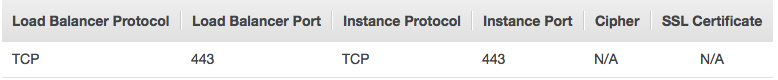
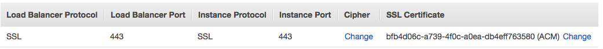

These are instructions on getting a "production grade" Openshift Origin (Kubernetes Distribution) cluster running on Amazon AWS region us-east-2.

# Production level Kubernetes

There are a lot of ways to deploy a Kubernetes cluster, but when it comes to a production grade setup to run mission critical applications the options for automatic provisioning are not as abundant. A production setup needs to provide high availability on several components of the cluster and it needs to be distributed across more then 1 data center.

I have tried several ways to deploy a production grade Kubernetes cluster and some observations:

 - A lot of tools work better with GCE compared to AWS
 - When deploying in AWS, many automation tools work on us-east-1 but not in other regions
 - Some tools had bugs that messed other parts of the AWS infrastructure
 - Most automation tools will have some combination of ansible, cloudformation(AWS specific) and terraform.
 - Nothing came close to openshift-ansible-contrib in terms automating the deployment of a production level kubernetes cluster

# Kubernetes. Now what?

 If you are new to kubernetes after you get a kubernetes setup going you will have many questions that will need to be answered, some of the questions might be:

- How to Load Balance Apps in the cluster in a highly available way?
- How do we handle Continuous Integration and deployment of apps?
- How to ensure High Availability of the Kubernetes master and nodes?
- How should we run DBs inside Kubernetes (if you choose to do so)?
- Do we run other services inside kubernetes (LDAP server, build server, etc)?
- How do we store data in Kubernetes?
- How to scale pods?
- How to layout the networking within AWS for Kubernetes?
- How do I divide the cluster amongst teams in my corporation?
- How do I look at the state of the pods in my cluster, watch their logs and etc?
- How do I perform maintenance operations on the cluster?
  - How do I add nodes to the cluster?
  - How do I update SSL certificates?


I found a lot of these answers by using a Kubernetes distribution, Openshift Origin. More specifically they have a [Reference Architecture](https://access.redhat.com/documentation/en-us/reference_architectures/2016/html-single/deploying_openshift_container_platform_3_on_amazon_web_services/#Add-Node) which can be deployed using the openshift-ansible-contrib project.

Another important resource is the [Openshift Origin](https://docs.openshift.org/latest/welcome/index.html) docs. I find a lot of additional value here because it documents a lot more then the core architecture of openshift, it also has a [Cluster Administration](https://docs.openshift.org/latest/admin_guide/index.html) and [Developer Guide](https://docs.openshift.org/latest/dev_guide/index.html) section. This is the benefit of using a PaaS solution built on top of kubernetes instead of just vanilla kubernetes.

# Openshift Origin on AWS

The Redhat reference architecture which is highly available and multi AZ can be automatically deployed through openshift-ansible-contrib, however there are some problems with deploying it in us-east-2 region and I needed to use this [branch/fork](https://github.com/cooktheryan/openshift-ansible-contrib/tree/az) that has the fixes to work outside us-east-1. During the deployment I have found a [few additional issues](https://github.com/openshift/openshift-ansible-contrib/pull/212) with the automation and worked with @cooktheryan who promptly applied patches.

### Proviosing

The starting point for getting the reference architecture deployed on AWS is reading the instructions [here](https://github.com/openshift/openshift-ansible-contrib/blob/master/reference-architecture/aws-ansible/README.md)

This [document](https://access.redhat.com/documentation/en-us/reference_architectures/2016/html-single/deploying_openshift_container_platform_3_on_amazon_web_services/) goes into more detail of the architecture we are deploying.

- I advise creating an ec2 instance using the CentOS Linux 7 x86_64 HVM EBS 1602 ami which is ami-6a2d760f in us-east-2 to setup the dependencies in order to run the Ansible code.
- If you need to retry make sure to remove hosts from failed attempts from ~/.ssh/known_hosts

Command used to bootstrap the cluster:
```
./ose-on-aws.py --keypair=gihad --public-hosted-zone=company.com --deployment-type=origin --ami=ami-6a2d760f --github-client-secret=secret --github-organization=company --github-client-id=id --region=us-east-2 --master-instance-type=m4.2xlarge --node-instance-type=m4.2xlarge --app-instance-type=m4.2xlarge
```

Command used to add a third App node:
```
./add-node.py --keypair=gihad --public-hosted-zone=company.com --deployment-type=origin --ami=ami-6a2d760f --region=us-east-2 --node-instance-type=m4.2xlarge --iam-role openshift-infra-NodeInstanceProfile-X7NQDJJ4KXB8 --node-sg sg-4de88924 --shortname ose-app-node03 --existing-stack openshift-infra --subnet-id subnet-029e734f
```
By default the reference architecture deploys 2 App nodes. The command above added a third node to 1 of the 3 private subnets(the one that didn't already have a node).

### Post Install

#### SSL certificates

By default the the cluster deployed during ose-on-aws.py will generate certificates which will not be valid for the domain and they will be installed in the Openshift EC2 instances. It will also generate 3 ELBs

- openshift-InfraElb
- openshift-MasterEx
- openshift-MasterIn

In the "Listeners" tab of both openshift-MasterEx and openshift-InfraElb there will be a listener setup this way:



They both need to be changed to SSL and have the certificate added:



The openshift-MasterIn ELB doesn't need to be changed.

note: AWS can generate certificates (including wildcard certs) for free that can only be used with ELB and Cloudfront, which seems to be enough for this setup.

#### Provisioning Storage

You may have apps with needs to persist data and they require storage which often is a EBS volume in AWS. One option is to manually create a persistentVolume and attach it to an application. Another option is to have a default StorageClass so that an application will automatically bind storage to itself. In either case we need to create a StorageClass, here is an example of creating a default StorageClass that will allow dynamic provisioning of EBS volumes.

create a file called generic-ebs-sc.yaml
```
kind: StorageClass
apiVersion: storage.k8s.io/v1beta1
metadata:
  name: generic
  annotations:
    storageclass.beta.kubernetes.io/is-default-class: "true"
provisioner: kubernetes.io/aws-ebs
parameters:
  type: gp2
```

Run `oc create -f generic-ebs-sc.yaml`
