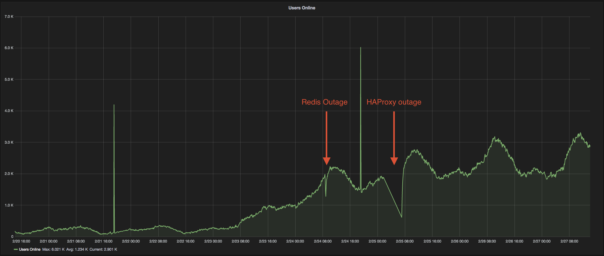

# Kings of Pool Launch

Kings of Pool was world wide launched on Tuesday, Feb 21st, 2017. On Thursday, Feb 23rd, 2017 it started to receive features from Android's Google Play and Apple's App Stores in many countries. These features have substantially increase the number of online users we received and added a lot of stress to several components of the backend.

Before going into launch it was accepted that there was risk with adding many users to the game due to the lack of coverage over the backend systems for Kings of Pool. Some efforts were done over a 3 weeks period before launch to identify potentials bottlenecks and some were identified and fixed but due to lack of technical understanding over these systems and time constraints some potential bottlenecks sources were missed and others (e.g.: flubsub and vuvuzela) were identified but not addressed.



## Disasters

There were 4 Disasters but only 2 caused downtime. The Redis issue caused a short outage of 10 minutes, the HAProxy outage was more serious and caused the game to be down from 2am to 7am on 25/02/2017.

24/02/2017

- [Redis - 8am]()
- [Flubsub - 7am]()

25/02/2017

- [HAproxy - 2am ~ 7am]()
- [Vuvuzela - 8am]()

### Redis - 24/02/2017 @ 8am

Pool production redis is configured to use AWS Elasticache, an instance with RAM size of 3GB. Pool uses redis in different ways, one of the main uses is as an in memory storage for a Replay Attack prevention solution.

Almost every request made to Pool's backend creates a key in redis and this key has a TTL. The combination of number of requests + redis server memory size(3gb) + long TTL of 5 hours and the verbosity of the HTTP pooling solution caused redis to quickly reach its memory capacity. Redis has expiry policies (e.g.: LRU) for when the memory limit is reached and this shouldn't cause an issue, but it still requires some tweaking.

The crippling error that we observed was:
```
Redis::CommandError: MISCONF Errors writing to the AOF file: No space left on device
```

AWS Elasticache doesn't let you know the disk size on this instances (It's hidden from the user) and you would hope that they provision enough disk space to account for AOF and RDB files. Since this didn't seem to be the case we hoped that an instance with double the size (as in RAM) would also have a larger disk.

Watching redis keys being set

Before (5 hours TTL)
```
1487973821.158271 [0 10.0.0.159:45462] "expire" "authenticate:187203:19i6gdp8dgCZawqN3hkHuahaihI=" "18000"
```
After (20 minutes TTL)
```
1487973821.158271 [0 10.0.0.159:45462] "expire" "authenticate:187203:19i6gdp8dgCZawqN3hkHuahaihI=" "1200"
```

#### Fixes

- Doubled the redis instance size to have 6GB RAM.
- Excluded the verbose messages endpoint from going to redis(no need for replay attack prevention here):  [FIX](https://github.com/uken/pool-rails/commit/542e1331ba46d4e3f7d11f2427a2575f271cd024)
- Lowered TTL from 5 hours to 20 minutes: [FIX](https://github.com/uken/pool-rails/pull/635/files)
- Added newrelic redis tracing: [FIX](https://github.com/uken/pool-rails/pull/633)

#### Result

After a few hours we observed redis memory usage to actually go down and stabilize as opposed to growing "unbounded".

- 4:47pm: used_memory_human:3.62G
- 5:03pm: used_memory_human:3.49G
- ~5 hours later:
```
admin@jumpbox:~$ redis-cli -h pool-redis.uken.int info | grep used_memory_human | cut -d: -f2 | awk '{print "pool.redis.usedmemory "$1}'
pool.redis.usedmemory 979.46M
```

### Flubsub - 24/02/2017 @ 7am

Flubsub is a node.js application properly coded with async and non-blocking code and as such should be able to handle many thousands of requests per second with just one single threaded process, avg response times should be bellow 5ms. It's used for chat within the game with Websocket connections. At some point avg response times started getting close to 20ms and finally the chat screens in the games stopped working but the flubsub server didn't log any error messages.

Investigating the servers we found that it hosts both Flubsub and vuvuzela and the server was never tweaked for high concurrency. We added several tweaks to support high number of connections and also tweaks relevant to Websockets. In linux almost everything is represented as a file (including sockets) and for that reason we also needed to increase file descriptor limits. Here is a list of tweaks that were done:

#### Flubsub response times

Leading up to the downtime the response times were already higher then they should have been. During the period of the chat being unavailable, after our online users count reached a threshold, we noticed that the number of established connections on flubsub's process would quickly cap at 1012:

```
[root@ip-10-0-0-239 current]# netstat -nlpa | grep ESTAB | grep node | wc -l
1012
```


#### Fixes

High QPS network tweaks
```
sysctl net.core.somaxconn=2048
sysctl net.core.netdev_max_backlog=5000
sysctl net.ipv4.tcp_max_syn_backlog=8096
ifconfig eth0 txqueuelen 5000
echo "/sbin/ifconfig eth0 txqueuelen 5000" >> /etc/rc.local (to stick)
```
For websockets
```
sysctl net.netfilter.nf_conntrack_tcp_timeout_established=600
```
Increasing file descriptor limits
```
edited /etc/security/limits.d/files.conf
added>    *     soft  nofile    100000
added>    *     hard  nofile    100000

edited /etc/systemd/system/flubsub-production-web.service
added>    LimitNOFILE=65000
```


### HAProxy - 25/02/2017 @ 2am

Duration: 5 hours

There was a catastrophic failure where all 4 instances of HAProxy failed at the same time. This is part of a very old infrastructure that most of the new games is completely independent from. The HAProxy instances only use init.d scripts instead of proper process managers and for that reason they didn't restart. The reason for all 4 instances to fail simultanously is unknown but it caused all our legacy infrastructure that is load balanced by HAProxy (and the apps that depend on them) to fail. This has brought down USys which in turn brought down Pool Rails backend servers.


HAProxy logs are directed towards elasticsearch but this has stopped working at some point since no logs could be found, there were also no logs from the linux kernel. A brief audit was done by checking syslog, lastlog, authlog, iptables logs, secure logs and some other indicators but nothing unsual was found.

#### Alerting
It's very concerning that no alerts were triggered at 2am when all HAProxy instances failed:

This means that the HAProxy instances themselves didn't trigger alerts and also all the affected infrastructure didn't trigger alerts. We are still investigating how this could have happened as many of these affected apps do have alerting setup.

You can see that an alert was manually trigger at 5:20am to summon help to deal with the issue.

#### USys Outage


Other apps that relied on HAProxy (including USys and Kings of Pool rails backend since it depends on USys) experienced a similar disruption from 2am to 7am.

#### Fix
The fix was to simply restart the HAProxy instances.

#### Actionables
Most of the infrastructure running on HA Proxy is around ~5 years old, we have been discussing sunsetting these apps. Bingo and Jeopardy are already completely independent from this. Pool's auth would have to be moved out of USys (e.g.: The new auth gem) and so would push notifications (champion uses HAProxy).

More generally, a lot of apps might be sunset in the next quarter and these apps are what currently runs on HAProxy.

### Vuvuzela - 25/02/2017 @ 8am

Vuvuzela is a ruby application that also uses Websockets. It provides fine grained real time movement feedback during games of pool and some other functionality such as doubling bets. This application has synchronous blocking code and it runs on ruby which is a slow runtime that by default can't use more then 1 thread on each process. When we crossed the threshold of 2500 users online, this single process was hitting 100% CPU and was no longer able to process requests in time.

Vuvuzela was previously assessed as not being able to scale horizontally due to the app storing state. We collectively decided against assigning resource to re-architecture it before launch and the risk was accepted, there was some hope that it would be an issue, however we received more users than expected.

We had to come up with a solution on the spot, the solution was

- Started 8 instances of vuvuzela on the server instead of 1
- installed nginx on the server
- Configured nginx to parse and tokenize the incoming request URLs and have an upstream load balancing according to a consistent hash algorithm, which was the token from the URL representing the room_id, in order to make sure that users in the same room were going to the same instance of vuvuzela.
- To make sure that this would work, we captured and inspected original TCP data going into vuvuzela and made sure that newly added nginx instance was not altering the data.

Simplified snippet of nginx Configured
```

    upstream vuvuzela {
       hash $vuvuserver consistent;
       server 127.0.0.1:2053;
       server 127.0.0.1:2054;
       server 127.0.0.1:2055;
       server 127.0.0.1:2056;
       server 127.0.0.1:2057;
       server 127.0.0.1:2058;
       server 127.0.0.1:2059;
       server 127.0.0.1:2060;
    }

    server {
        location ~ ws/(.*)(/)(.*) {
           # Headers needed for websockets
           proxy_http_version 1.1;
           proxy_set_header Upgrade "websocket";
           proxy_set_header Connection "Upgrade";
           # extracting the room id from the URL PATH to load balance according to a hash of the room_id. setting variable
           set $vuvuserver $1;
           proxy_pass http://vuvuzela;
  }

```

This was a quick solution to allow us to scale the app horizontally and restore service to users quickly (can now use several cores on the server instead of being limited to 1)

#### CPU Usage on vuvuzela/flubsub server (AKA realtime server)


#### Vuvuzela Error rate


### Other optimizations

- Increased unicorn worker count from 16 to 32
- The AWS Aurora instance for Kings of Pool started hitting 100% usage which caused average response times from request to triple. We added 2 indexes to tables that solved the issue and brought usage down to bellow 50%
  - CREATE INDEX index_club_memberships ON club_memberships(`user_id`)
  - CREATE INDEX index_cues_users_on_user_id ON cues_users(`user_id`)
